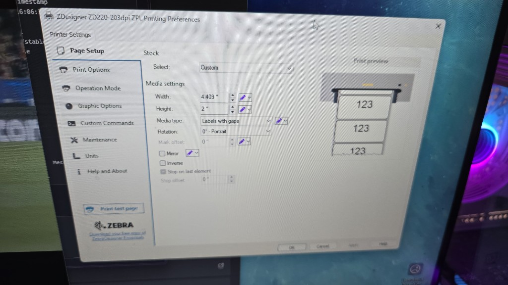
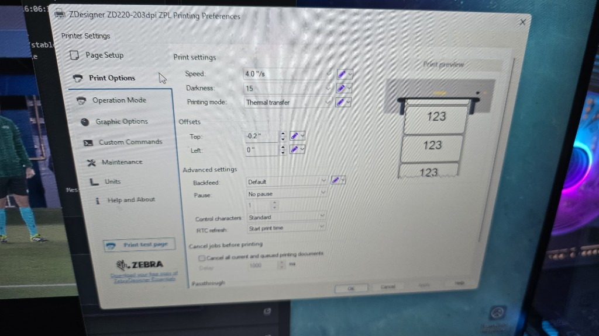
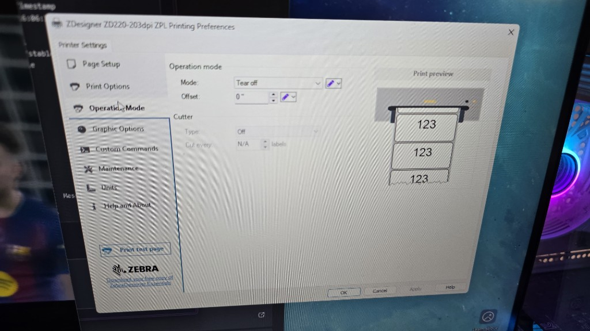
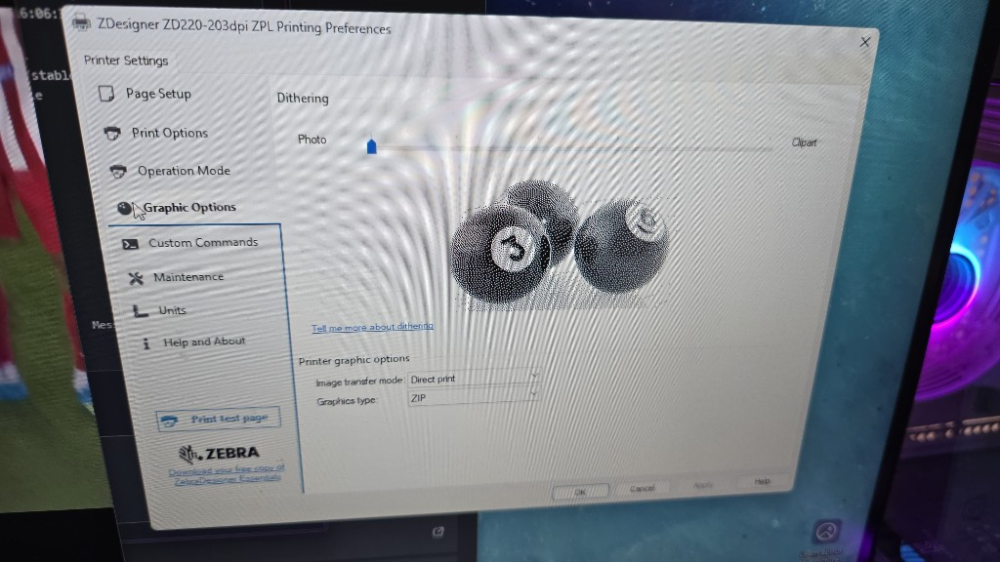

# Guía de instalación — Impresora Zebra ZD220 (etiquetas de código de barras)

**GuapoTrajes — Uso interno**

Esta guía está pensada para el personal del local que deba instalar y configurar la impresora de etiquetas con código de barras que usamos en cada prenda del inventario. La misma impresora sirve para:

- Imprimir **una etiqueta** desde **Productos**, **Lavandería** o **Modista**
- La **impresión masiva** de etiquetas pendientes en **Etiquetas inventario**

> **Importante:** Esta impresora **no** es la de armado de conjuntos. Para las etiquetas grandes del armado se usa la **Xprinter XP-470B** (otra guía).

---

## 1. Datos de la impresora

| Concepto | Valor |
|----------|-------|
| **Marca / modelo** | **Zebra ZD220** (serie ZD200) |
| **Resolución** | 203 dpi |
| **Lenguaje** | **ZPL** |
| **Nombre del driver en Windows** | `ZDesigner ZD220-203dpi ZPL` |
| **Formato de etiqueta en el sistema** | **50 × 25 mm** (nombre del producto + código de barras CODE128) |
| **Modo de impresión** | Transferencia térmica (*Thermal transfer*) |
| **Conexión** | USB (cable incluido con la impresora) |

El modelo fue confirmado en la configuración operativa del local y coincide con el driver que aparece en las capturas de referencia de esta guía.

---

## 2. Antes de empezar — Qué necesitás

- PC con **Windows 10 u 11** (la computadora operativa del local)
- Usuario con permisos de **administrador** en la PC
- Impresora **Zebra ZD220** apagada al inicio de la instalación del driver
- Rollo de etiquetas compatible instalado en la impresora
- Acceso a internet para descargar el driver oficial
- Navegador **Google Chrome** (recomendado para usar GuapoTrajes)
- *(Opcional pero recomendado)* **QZ Tray** instalado, para que las etiquetas salgan directo sin elegir impresora en cada impresión

---

## 3. Instalación del driver en Windows

### Paso 1 — Descargar el software oficial

1. Entrá a la página de soporte de Zebra: [https://www.zebra.com/us/en/support-downloads/printers/desktop/ZD200d.html](https://www.zebra.com/us/en/support-downloads/printers/desktop/ZD200d.html)
2. En la pestaña **Downloads**, descargá:
   - **Windows Printer Driver v10** (recomendado por Zebra)
   - **Zebra Setup Utilities (ZSU)** — ayuda a detectar la impresora y calibrar el rollo
3. Si después de instalar el driver v10 la impresión falla, Zebra sugiere desinstalar el v10 e instalar el **Windows Printer Driver v5** como alternativa.  
   Referencia: [artículo de soporte Zebra](https://support.zebra.com/article/000027608)

También podés buscar el driver desde [https://www.zebra.com/drivers](https://www.zebra.com/drivers) ingresando **ZD220**.

### Paso 2 — Instalar el driver

1. **Apagá** la impresora.
2. Ejecutá el instalador descargado (por ejemplo `zddriver-v10-…-installer.exe`) **como administrador**.
3. Seguí el asistente. Cuando lo pida, **conectá el cable USB** y **encendé** la impresora.
4. Elegí el modelo **ZDesigner ZD220-203dpi ZPL** cuando aparezca en la lista.
5. Completá la instalación y verificá en **Configuración → Bluetooth y dispositivos → Impresoras y escáneres** que figure la impresora instalada.

### Paso 3 — Calibrar el rollo (recomendado)

1. Abrí **Zebra Setup Utilities**.
2. Seleccioná la ZD220 conectada.
3. Ejecutá **Calibrate Media** (calibrar medios) para que la impresora detecte bien el tamaño de las etiquetas y los espacios entre ellas.
4. Imprimí una **etiqueta de prueba** desde las utilidades o con el botón **Print test page** del driver (ver sección 4).

---

## 4. Configuración del driver (valores oficiales del local)

Abrí las preferencias de impresión:

**Configuración → Impresoras y escáneres → ZDesigner ZD220-203dpi ZPL → Administrar → Preferencias de impresión**

Replicá **exactamente** estos valores en cada pestaña del menú lateral **Printer Settings**:

### 4.1 Page Setup (Configuración de página)



| Campo | Valor |
|-------|-------|
| Stock Select | **Custom** |
| Width (ancho) | **4,409"** |
| Height (alto) | **2"** |
| Media type | **Labels with gaps** (Etiquetas con separación) |
| Rotation | **0° - Portrait** |
| Mark offset | **0"** |
| Mirror | Desmarcado |
| Inverse | Desmarcado |

### 4.2 Print Options (Opciones de impresión)



| Campo | Valor |
|-------|-------|
| Speed | **4,0 "/s** |
| Darkness (oscuridad) | **15** |
| Printing mode | **Thermal transfer** |
| Top offset | **-0,2"** |
| Left offset | **0"** |
| Backfeed | **Default** |
| Pause | **No pause** |
| Control characters | **Standard** |
| RTC refresh | **Start print time** |
| Cancel all current and queued printing documents | **Desmarcado** |

### 4.3 Operation Mode (Modo de operación)



| Campo | Valor |
|-------|-------|
| Mode | **Tear off** (desprender manualmente) |
| Offset | **0"** |
| Cutter (cortadora) | **Off** |

### 4.4 Graphic Options (Opciones gráficas)



| Campo | Valor |
|-------|-------|
| Dithering (difuminado) | Hacia **Photo** (lado izquierdo del control deslizante) |
| Image transfer mode | **Direct print** |
| Graphics type | **ZIP** |

### Paso final

1. Pulsá **Apply** y luego **OK**.
2. Usá el botón **Print test page** (abajo a la izquierda del panel) para confirmar que imprime bien antes de usar GuapoTrajes.

---

## 5. Configuración en GuapoTrajes

El sistema genera etiquetas de **50 × 25 mm** con el nombre de la prenda y su código de barras. Para que salgan por la Zebra sin confusiones:

### 5.1 Desde el navegador (sin QZ Tray)

Al imprimir desde **Productos**, **Lavandería**, **Modista** o **Etiquetas inventario**, Chrome abrirá el diálogo de impresión. Verificá:

| Opción en Chrome | Valor |
|------------------|-------|
| Destino | **ZDesigner ZD220-203dpi ZPL** (o la que contenga “Zebra”) |
| Tamaño de papel | El más cercano a **50 × 25 mm** (o personalizado si hace falta) |
| Márgenes | **Ninguno** |
| Escala | **100 %** |
| Gráficos en segundo plano | **Activado** |

### 5.2 Con QZ Tray (recomendado en el local)

Si QZ Tray está instalado y en ejecución, el sistema puede enviar la impresión directo a la Zebra.

1. En GuapoTrajes, andá a **Reportes** (o la sección donde aparece el panel de configuración de impresoras).
2. Abrí **Configuración de impresoras (armado)**.
3. Activá **Usar QZ Tray (impresión directa por impresora)**.
4. En **Etiquetas por prenda (código de barras)**, escribí un fragmento del nombre que coincida con la impresora, por ejemplo: **`Zebra`** o **`ZD220`**.
5. Pulsá **Probar QZ Tray**. Debe mostrar *QZ Tray conectado* y listar las impresoras detectadas.
6. La primera vez, QZ Tray pedirá permiso para que GuapoTrajes se conecte: aceptá y marcá **Remember this decision**.

> La impresora de **Etiqueta resumen del conjunto** es otra (Xprinter XP-470B). No la cambies en este paso.

---

## 6. Probar que todo funciona

### Prueba rápida (fuera del sistema)

1. Preferencias de impresión → **Print test page**.
2. Debe salir una etiqueta de prueba legible, bien centrada y con buen contraste.

### Prueba desde GuapoTrajes

1. Entrá al sistema con tu usuario.
2. Andá a **Productos**, elegí un producto cualquiera y usá la acción **Etiqueta** / **Imprimir**.
3. Confirmá que la etiqueta muestra:
   - Nombre o descripción de la prenda (arriba)
   - Código de barras CODE128 (abajo)
4. Para la migración masiva, probá en **Etiquetas inventario** con 2 o 3 productos antes de imprimir lotes grandes.

---

## 7. Dónde se usa esta impresora en el sistema

| Sección | Qué imprime |
|---------|-------------|
| **Productos** | Una etiqueta 50×25 mm por producto |
| **Lavandería / Modista** | Etiquetas de las prendas marcadas en la bolsa |
| **Etiquetas inventario** | Impresión masiva de etiquetas pendientes del inventario |

---

## 8. Problemas frecuentes y soluciones

| Problema | Qué hacer |
|----------|-----------|
| Windows no detecta la impresora | Revisar cable USB, probar otro puerto, reiniciar PC e impresora |
| Imprime en blanco o muy claro | Subir **Darkness** de a 1–2 puntos (máx. ~18). Verificar que el ribbon (cinta) esté bien colocado si es transferencia térmica |
| Imprime muy oscuro o mancha | Bajar **Darkness** o reducir **Speed** |
| La etiqueta queda corrida | Ajustar **Top offset** en pasos de 0,05". Recalibrar con Zebra Setup Utilities |
| Imprime varias etiquetas en blanco | Ejecutar **Calibrate Media**; confirmar **Labels with gaps** |
| Chrome no muestra la Zebra | Verificar que esté instalada en Windows y reiniciar Chrome |
| QZ Tray no conecta | Verificar que QZ Tray esté abierto (ícono en la bandeja), aceptar el permiso del sitio y pulsar **Probar QZ Tray** |
| El código de barras no escanea | Reimprimir con **Escala 100 %** y sin márgenes; limpiar el cabezal de impresión |

---

## 9. Mantenimiento básico

- Usar **etiquetas y ribbon** compatibles con transferencia térmica.
- Limpiar el cabezal de impresión cuando baje la calidad (kit de limpieza Zebra o alcohol isopropílico según manual del fabricante).
- Tras cambiar el rollo o el tamaño de etiqueta, **recalibrar** y revisar la sección 4 de esta guía.
- No cambiar la configuración del driver sin avisar al responsable del sistema.

---

## 10. Resumen de referencia rápida

```
Impresora:     Zebra ZD220 — 203 dpi — ZPL
Driver:        ZDesigner ZD220-203dpi ZPL
Etiqueta app:  50 × 25 mm (código de barras por prenda)
Modo:          Thermal transfer — Tear off
Speed:         4 ips — Darkness: 15
Page Setup:    Custom 4,409" × 2" — Labels with gaps — Portrait
```

---

## Contacto

Si después de seguir esta guía la impresión sigue fallando, avisá al responsable técnico de GuapoTrajes indicando:

- Qué sección del sistema estaban usando
- Si el fallo es en la prueba del driver o solo desde GuapoTrajes
- Captura del diálogo de impresión o del mensaje de error

---

*Documento generado para GuapoTrajes — Junio 2026*
